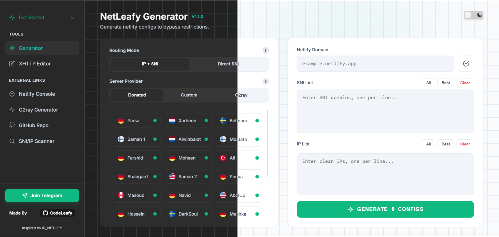

<div align="center">

# NetLeafy

> Client-side VLESS-over-xHTTP configuration generator for Netlify's edge network.

[](LICENSE)
[](https://github.com/Code-Leafy/NetLeafy/stargazers)
[](https://developer.mozilla.org/docs/Web/HTML)

### [Open the generator →](https://Code-Leafy.github.io/NetLeafy)

</div>

## Overview

NetLeafy generates xHTTP configurations entirely in the browser. It uses Netlify's global edge as the front-end relay, producing resilient connections without any backend.

> Everything runs client-side — no data leaves your device.

## Preview

<div align="center">

</div>

## Features

- Hybrid routing: direct SNI or IP + SNI (Shecan mode).
- Community servers, custom nodes, or G2ray extraction from `vless://` links.
- xHTTP parameter editor (`xPaddingBytes`, `scMaxEachPostBytes`, custom headers).

## Usage

Open **[Code-Leafy.github.io/NetLeafy](https://Code-Leafy.github.io/NetLeafy)**, or run locally:

```bash
git clone https://github.com/Code-Leafy/NetLeafy.git
cd NetLeafy
# open index.html in any modern browser
```

## Project structure

```text
NetLeafy/
├── index.html   # Entire app (UI + logic)
├── favicon.png  # App icon
└── assets/      # Preview images
```

## License

[MIT](LICENSE)

> Educational use. You are responsible for complying with local laws.
